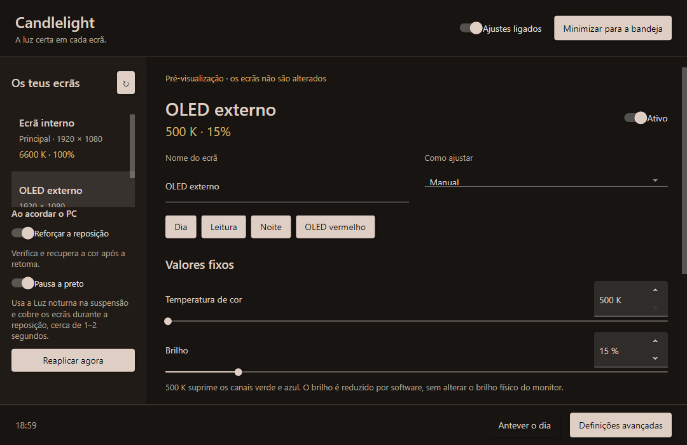

# Candlelight

<p></p>

**0.2.3 hardware-test prototype:** a smaller, independent application now uses
the documented Windows Magnification API instead of gamma/Night Light handovers.
With one enabled monitor, the desktop filter includes the Windows taskbar;
coverage at 2700 K / 100% was physically confirmed on the internal panel.
It includes saved monitor profiles, explicit red-only mode, presets and daily
schedules. Different per-monitor values use a windowed renderer whose taskbar
coverage remains unresolved. See [the renderer and test gates](docs/next-engine.md).
Run `Candlelight.Next.exe`; build/package with `scripts/publish-next.ps1`.
The 0.1.4 physical wake test failed, so it is retained as a rollback baseline,
not a verified flash-free solution. Real wake testing of 0.2 is still required.

## Legacy 0.1.4 implementation

A Windows fork of [LightBulb](https://github.com/Tyrrrz/LightBulb) with independent
monitor profiles, exact-zero red-only output, quick presets and custom daily
schedules. Current version: **0.1.4**.

- Each connected monitor has its own temperature and software brightness (1–100%).
- Choose **Dia / noite**, **Manual**, or **Horários** for each screen.
- **OLED vermelho** sets 500 K and 15% brightness on the selected monitor only.
- Presets can be saved, replaced by name, deleted and applied with one click.
  Built-in presets are also available from the tray for the last selected monitor.
- Daily schedules accept any `HH:mm`, temperature, brightness and transition
  duration. Zero minutes switches instantly; other values start a smooth transition
  at that time. Schedules wrap midnight and repeat every day. Overlapping transitions
  are shortened to end at the next point. Invalid or duplicate times retain the last
  valid schedule.
- Resume, display power-on and unlock recover current values, followed by five
  seconds of verification. Protected handovers apply profiles behind a brief
  black cover. Startup skips the daylight-to-night fade.
- If GDI rejects a ramp or reports success without applying it, Candlelight tries
  the Windows color-system LUT and verifies it by reading that same layer back.
  A nonneutral GDI layer is neutralized afterwards so brightness is not multiplied
  twice; an already neutral layer is left untouched during recovery retries.
  This compatibility path is selected independently for each affected monitor.
  Context recreation retains its selection; exit resets both layers.
  A color-system filter left by an earlier process is detected, so controls cannot
  silently modify a different layer beneath an old filter. Startup waits until
  settings are loaded before allowing recovery events to apply colors.
- Physical EDID identity preserves profiles across HDMI/USB-C when the monitor
  reports the same serial. Devices without usable serials use the connection path.
- The app and settings use the Candlelight name. Updates from original LightBulb
  cannot overwrite this fork.

## Run



Extract the portable package and run **Candlelight.exe**. Close original LightBulb,
Ahead or other gamma tools first so they do not overwrite each other. Choose the
OLED in the left rail, apply **OLED vermelho**, then adjust its brightness. Set the
internal screen's brightness to 100% separately. Changes save automatically.

This version targets SDR displays in an extended desktop. Windows/driver gamma
resets can occur before an application receives a resume event, so elimination of
every flash is not guaranteed. Color-system writes/readback and visible color
changes were verified on the HDMI OLED and internal panel. Lid reopening retained
warmth, while a Modern Standby resume produced a brief intermediate blue flash.
Night Light prevented that blue flash on the internal panel, but keeping both
filters active caused visible alternation. The protected handover in 0.1.4 failed
its physical suspension retest; the 0.2 renderer replaces that mechanism.
Hibernation and USB-C remain hardware checks.
Version 0.1.4 adds a protected Night Light handover: a brief black cover hides
the switch back to each monitor's Candlelight profile. The **Pausa a preto**
option is enabled by default. Strength and schedule are preserved, and hardware
verification remains necessary to establish flash-free wake on a given driver.
See [wake recovery details](docs/wake-recovery.md).

Settings are stored beside a writable portable executable, or in
`%APPDATA%/Candlelight/Settings.json` for an installation. `CANDLELIGHT_SETTINGS_PATH`
can override this. Existing LightBulb settings are not automatically imported.

## Build and verify

Requires .NET SDK 10 on Windows.

```powershell
dotnet build LightBulb.slnx --configuration Release
dotnet test LightBulb.Core.Tests --configuration Release --no-build
dotnet LightBulb/bin/Release/net10.0-windows/Candlelight.dll --preview --capture-preview=artifacts/ui
dotnet LightBulb/bin/Release/net10.0-windows/Candlelight.dll --diagnose-displays
./scripts/publish.ps1
```

`--preview` uses synthetic monitors and never writes hardware gamma or autostart
registry values. `--capture-preview=...` verifies the compiled controls, captures
three interface states and exits. `--list-displays` reports detected displays
without changing colors. `--diagnose-displays` reads the GDI and color-system LUTs;
`--diagnose-displays=report.txt` also saves the report. Both are read-only.
CI builds a self-contained Windows x64 portable ZIP. Packaging excludes local settings.
`ColorStatus.txt` is a bounded local diagnostic trace of requested values, recovery writes and errors;
it is excluded from packages. It contains no location data.
Installer source is rebranded but an installer is not distributed with v0.1.2.

The exact-zero color/ramp handling is adapted from
[LightBulb Ahead](https://github.com/karipesonen/LightBulb-Ahead).
See [third-party credits](THIRD_PARTY.md) and the preserved [MIT license](License.txt).

## Original LightBulb documentation

The following section describes upstream LightBulb; its downloads refer to the
original program.

# LightBulb

[](https://github.com/Tyrrrz/.github/blob/prime/docs/project-status.md)
[](https://tyrrrz.me/ukraine)
[](https://github.com/Tyrrrz/LightBulb/actions)
[](https://codecov.io/gh/Tyrrrz/LightBulb)
[](https://github.com/Tyrrrz/LightBulb/releases)
[](https://github.com/Tyrrrz/LightBulb/releases)
[](https://discord.gg/2SUWKFnHSm)
[](https://twitter.com/tyrrrz/status/1495972128977571848)

<table>
    <tr>
        <td width="99999" align="center">Development of this project is entirely funded by the community. <b><a href="https://tyrrrz.me/donate">Consider donating to support!</a></b></td>
    </tr>
</table>

<p align="center">
    
</p>

**LightBulb** is an application that reduces eyestrain produced by staring at a computer screen when working late hours.
As the day goes on, it continuously adjusts gamma, transitioning the display color temperature from cold blue in the afternoon to warm yellow during the night.
Its primary objective is to match the color of the screen to the light sources of your surrounding environment — sunlight during the day and artificial light during the night.
**LightBulb** has minimal impact on performance and offers many customization options.

> ❔ If you have questions or issues, **please refer to the [wiki](https://github.com/Tyrrrz/LightBulb/wiki)**.

## Terms of use<sup>[[?]](https://github.com/Tyrrrz/.github/blob/prime/docs/why-so-political.md)</sup>

By using this project or its source code, for any purpose and in any shape or form, you grant your **implicit agreement** to all the following statements:

- You **condemn Russia and its military aggression against Ukraine**
- You **recognize that Russia is an occupant that unlawfully invaded a sovereign state**
- You **support Ukraine's territorial integrity, including its claims over temporarily occupied territories of Crimea and Donbas**
- You **reject false narratives perpetuated by Russian state propaganda**

To learn more about the war and how you can help, [click here](https://tyrrrz.me/ukraine). Glory to Ukraine! 🇺🇦

## Download

- 🟢 [**Stable release**](https://github.com/Tyrrrz/LightBulb/releases)
- 🟠 [CI build](https://github.com/Tyrrrz/LightBulb/actions/workflows/main.yml)
- 📦 [WinGet](https://winget.run/pkg/Tyrrrz/LightBulb): `winget install Tyrrrz.LightBulb` (community-maintained)
- 📦 [Scoop](https://scoop.sh/#/apps?q=LightBulb&p=1&id=9639ce8d7756b4c8a252368ef718c25b5a3b4ce0): `scoop install extras/lightbulb` (community-maintained)
- 📦 [Chocolatey](https://push.chocolatey.org/packages/lightbulb): `choco install lightbulb` (community-maintained)

> [!NOTE]
> Community-maintained packages are published independently from this repository and may not always be up to date with the latest release.

> [!NOTE]
> If you're unsure which build is right for your system, consult with [this page](https://useragent.cc) to determine your OS and CPU architecture.

## Features

- Extensive customization options
- Location-based sunrise and sunset times
- Manual sunrise and sunset times
- Whitelist for color-sensitive applications
- Global hotkeys for adjusting on the fly
- Smooth gamma transitions
- Minimal performance impact
- Works without internet connection

## Screenshots


