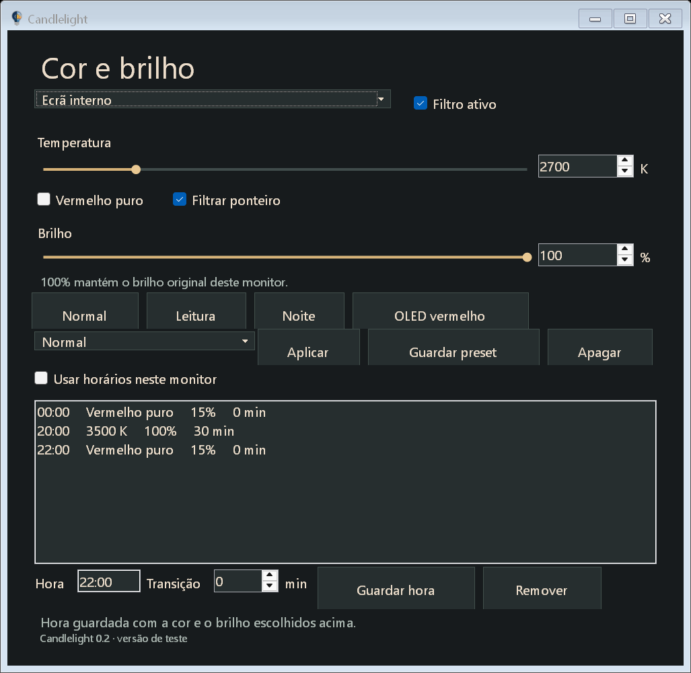

# Candlelight 0.2: essential controls and a new renderer

<p></p>

This is a hardware-test prototype. The failed 0.1.4 wake test showed black,
then red, then white/blue, then orange. Gamma readback and fixed delays did not
establish the final displayed color. The new application does not use that
handover, gamma ramps, private color-system exports or Night Light writes.

## What is included



- Independent, saved profiles for each monitor, using physical EDID identity
  when a serial is available. The internal 2700 K / 100% and OLED red / 15%
  profiles are imported into a separate settings file.
- Temperature and software brightness, with numeric input and sliders.
- An explicit **Vermelho puro** mode. It preserves red and sets green/blue
  to exact zero; purely blue/green objects become black.
- Four quick presets, named saved presets and a tray menu.
- Daily time points with per-point transition durations. A later point bounds
  the preceding transition. Entering/leaving red-only mode switches immediately
  so a requested red-only period never fades through green/blue.
- Closing the control window hides it. **Sair** in the tray exits the renderer.
  Rendering and schedule evaluation run independently of that window.
- **Filtrar ponteiro** colors standard Windows cursors without mouse trails.
  Turning it off, pausing the filter or exiting restores the original cursors.

The first version omits location, sunrise/sunset, application exceptions,
theme settings and the original updater.

## Renderer

`Candlelight.Engine` owns a dedicated STA thread and native message loop.
`MagSetFullscreenColorEffect` applies a shared 5x5 color matrix to the entire
desktop. With equal profiles, no local surfaces are needed. Version 0.2.4 also
uses the componentwise maximum of the requested channel gains as a shared filter
for mixed profiles. Each monitor's remaining attenuation is applied by a local
surface only where needed. Disabled or unknown displays contribute identity,
so the shared matrix cannot remove a channel they need. A zero shared channel
uses an identity local factor instead of dividing by zero.

For the tested internal 2700 K / 100% and OLED pure-red / 15% combination, the
shared gain equals the internal profile. Its entire desktop, including the main
taskbar, receives that color without a local surface. Only the OLED needs a
local correction (red 0.15, green/blue zero). The user previously confirmed
global taskbar coverage on the internal panel and local coverage on the OLED;
physical confirmation of this combined path remains required.
The preceding desktop effect is saved and
restored when the filter is paused or the app exits, provided another application
has not replaced it. Resume uses a black desktop effect for 300 ms before the
desired color. Matrix readback is exposed as `DesktopEffectVerified`; it is not
a measurement of panel light or proof of physical wake behavior.

### Native cursor filtering without trails (0.2.2–0.2.4)

On this driver, the desktop color effect leaves the hardware cursor white.
A temporary minimum mouse-trails experiment made it warm, including over the
taskbar, but the user rejected the visible trail. Trails were restored to zero;
the application never changes that Windows setting.

Both renderer paths make temporary colored copies of 13 standard Windows
cursor shapes using `GetIconInfo`, `CreateIconIndirect` and `SetSystemCursor`.
It preserves dimensions, click hotspots, alpha and black outlines, and applies
the current temperature/brightness or exact-red gains to their pixels. Copies
come from the original images, so profile changes never compound their tint.
The pointer's current physical monitor selects its final gain; the global/local
desktop factors are not applied twice to its pixels. Monitor membership is
checked on the renderer timer using cached display bounds. An unchanged gain
does not replace cursors or write recovery state. Both magnifier paths keep the
system pointer visible and omit `MS_SHOWMAGNIFIEDCURSOR`, so pointer motion is
independent of captured desktop frames. No mouse-speed or trails setting changes.
The normal preset retains the original shapes. No cursor scheme or registry
setting is written. The original native handles are copied back on pause, exit
or disabling cursor filtering. A changed Windows cursor theme is
rebased without restoring over the user's new shapes.

A local `SystemCursorLease.json` records ownership and original pixels for
recovery on the next launch after an interrupted exit. Installed fingerprints
are read back after each replacement because Windows can resample installed
cursor bitmaps for DPI. The lease records each completed replacement; no state
is written while the pointer stays on a monitor with an unchanged gain. Only still-owned shapes
are recovered, including when cursor filtering is disabled. Normal exit restores
native cursor copies; recovery after a crash can restore only static pixels.
Monochrome background-inverting strokes become colored strokes with a black
edge. Animated busy cursors currently use a static colored frame while filtered.
Application-specific cursors and the secure desktop are outside this standard
cursor replacement mechanism. `SystemCursorsFiltered` reports replacement of
the standard table, not proof that every application cursor is filtered.

Local corrections use opaque, click-through, non-activating Magnification
controls. If the desktop API is unavailable, the prototype uses the original
per-monitor gains in these controls instead. Magnification
is 1x. Each source rectangle is its monitor's physical bounds; all renderer
hosts are excluded from capture to avoid feedback. **Local surfaces retain a
taskbar coverage limitation.** Ordinary topmost hosts failed to filter the
auto-hidden Windows taskbar on this machine, even when raised on every refresh.
The global portion reaches those shell surfaces. The full requested color on
every monitor's shell is guaranteed by the plan only when its gain matches the
shared gain; other shell coverage needs physical testing. The app shows the
existing warning when the global API is unavailable. Different settings are
applied as a batch, avoiding an intermediate plan between monitors.

In that per-monitor path, the same opaque hosts stay in place during suspension.
Suspend, display-off and
session-lock notifications hide their magnifier children, exposing the hosts'
black background. The real color matrix remains prepared. Resume refreshes the
same surfaces and shows their filtered children after a 300 ms settling period.
Notifications coalesce. Nothing switches Night Light or removes a cover to
expose an independently changing gamma filter. Refresh slows while locked/off.
The compositor is explicitly asked to repaint after source updates, as in the
Microsoft sample. The host also reclaims its topmost position on every refresh,
as that sample does, rather than only during the once-per-second diagnostic.
A black color matrix passed readback but left a cached black
image in the simulated resume test on this driver; black protection therefore
uses the host background rather than a zero matrix.
The native pointer remains visible; it is never captured into local frames.

This is an architectural change, not proof that the compositor/driver never
presents a normal frame. App windows cannot cover the secure desktop, boot,
every exclusive full-screen surface or another process's higher overlay. HDR,
protected video, touch, multiple monitor layouts and performance need hardware
tests. Software dimming does not lower a monitor's hardware brightness setting.

## Verification and remaining gates

The `--probe` mode explicitly exercises the windowed per-monitor renderer, creates
its own low-intensity color patches on a black source
window and samples their rendered output. It tests normal, 2700 K, red at 15%
and 100%, dimming, black protection, simulated resume and independent frame
updates. The captures show application/compositor output; they do not measure
panel light, certify shell coverage or establish real sleep/resume behavior.
Fullscreen desktop effects are a later compositor stage; those windowed pixel
samples must not be reported as proof of the global effect. Simulated notifications
are explicitly distinguished from physical suspension.

`--probe-mixed=<directory>` uses dark source patches on two real monitors. It
checks warm internal / red OLED profiles, a single local surface, lower-brightness
matrix composition, pause isolation, simulated black/resume and desktop readback.
It also installs native identity/warm/red cursor copies, verifies their color,
alpha and hotspots after Windows' DPI resampling, and restores the originals.
Only the four owned patch centers are sampled; desktop images are never saved.

`--preview` instantiates the real control window with synthetic monitor profiles,
verifies 4000 K / 2700 K edits, exact-red selection, monitor isolation and schedule
controls and the cursor option, and renders only that application's UI. It never
starts the renderer. `--probe-cursors=<directory>` reads only cursor bitmaps,
tests native identity/warm/exact-red copies of all 13 standard shapes, and checks
their alpha, dimensions and hotspots. It reads the mouse-trail preference without
changing it and never replaces system cursors or starts another magnifier.

After the global taskbar correction, the user reported that wake behavior appeared
to be working. This is provisional feedback; repeated physical suspension,
hibernation and external-monitor tests remain open.

Physical gates before treating this as a reliable replacement:

1. Internal panel: hidden control window, 15-second suspension, lid reopening
   and display wake; repeat and observe whether any blue frame appears.
2. Verify hidden-window changes, cursor visibility, normal mouse use, scrolling,
   video, auto-hidden taskbar/menu coverage and acceptable battery/CPU/GPU cost.
3. Resolve shell coverage with differing per-monitor values. OLED reconnected:
   red at 15%, internal at 100%, independent changes and
   monitor unplug/replug. Then USB-C, negative monitor coordinates and mixed DPI.
4. Hibernation, lock/unlock and full-screen applications. Secure desktop protection
   is not promised by this user-session renderer.

## Run and build

Version 0.2.3 applies the approved candle-tip icon with the smaller flame to the
executable, control window and notification area. The same shared icon is used
by the legacy executable and installer; see [icon sources and export](https://github.com/DacostaWeb/Candlelight/blob/prime/assets/icon/README.md).

Run `Candlelight.Next.exe`. Settings are stored in
`%LOCALAPPDATA%/Candlelight.Next/Settings.json`; diagnostics are bounded and stored
there as `Renderer.log`. Legacy settings are not overwritten.

```powershell
dotnet build LightBulb.slnx -c Release
dotnet test LightBulb.Core.Tests -c Release --no-build
dotnet Candlelight.Next/bin/Release/net10.0-windows/Candlelight.Next.dll --preview=artifacts/next-ui
dotnet Candlelight.Next/bin/Release/net10.0-windows/Candlelight.Next.dll --probe=artifacts/next-probe
./scripts/publish-next.ps1
```

`--import=<legacy Settings.json>` imports monitor values on the first start only.
`--settings=<path>` isolates a settings store. `--hidden` starts in the tray.
The current-user/session-only control pipe supports `--command=status`, `show`,
`hide`, `set`, `pause`, `cursor-on`, `cursor-off` and `stop`; `--response=<file>`
saves a diagnostic response.
`set` accepts `--monitor=<id>`, `--temperature=2700`, `--brightness=100` and optional
`--red`. These switches control this application only.
The diagnostic commands `probe-suspend` and `probe-resume` exercise the same
renderer paths without physically suspending the computer. `Frames` counts
source-update requests in the windowed path and effect writes in the desktop
path; neither is a displayed-frame counter.

During development, initializing a second global magnifier as a temporary black
update guard caused the replacement application's desktop-effect writes to fail
with Win32 error 87. The replacement succeeded when started without that guard.
Do not use a concurrent global magnifier for updates or interpret this failure
as a need for elevation or UIAccess. The exact ownership interaction remains
unverified; no certificate/security-policy changes were made.

`Candlelight.Migration` is a separate, one-shot cleanup tool. After the new
renderer is active and the old process has exited, it recognizes only ramps
matching saved legacy monitor profiles and clears them. Unknown ramps are left
untouched. It restores an owned Night Light token if present. The new app does
not ship or depend on that tool or on `LightBulb.*` runtime assemblies.
The migration tool's optional `--night-light-off` isolates a prototype test and
saves the preceding active state in its build directory for rollback. It is a
one-time setup operation, not an automatic feature of the renderer.

The 0.1.4 executable/settings remain available for rollback; no claim of
flash-free physical wake is made until these gates pass.

Sources:

- [Microsoft Magnification API overview](https://learn.microsoft.com/en-us/windows/win32/winauto/magapi/magapi-intro)
- [Microsoft MagSetColorEffect](https://learn.microsoft.com/en-us/windows/win32/api/magnification/nf-magnification-magsetcoloreffect)
- [Microsoft MagSetFullscreenColorEffect](https://learn.microsoft.com/en-us/windows/win32/api/magnification/nf-magnification-magsetfullscreencoloreffect)
- [Microsoft SetSystemCursor](https://learn.microsoft.com/en-us/windows/win32/api/winuser/nf-winuser-setsystemcursor)
- [Microsoft CreateIconIndirect](https://learn.microsoft.com/en-us/windows/win32/api/winuser/nf-winuser-createiconindirect)
- [Microsoft windowed magnifier sample](https://github.com/microsoft/Windows-classic-samples/blob/main/Samples/Magnification/cpp/Windowed/MagnifierSample.cpp)
- [Microsoft gamma-ramp limitations](https://learn.microsoft.com/en-us/windows/win32/api/wingdi/nf-wingdi-setdevicegammaramp)
